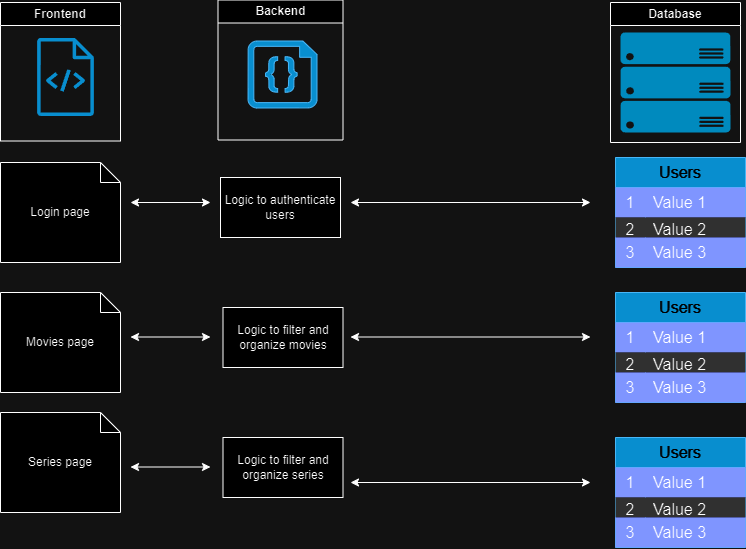

# DOCUMENTATION 🗂

## 1 - Title: CineList Website


## 2 - About the project ⚙️
2.2 - The programming language chosen for this application was `Python` and it was developed in the `version 3.12.1`.<br>
2.3 - The application uses `FastAPI`, a modern web framework for building `APIs` with `Python`.<br>
2.4 - `FastAPI` offers high performance, async code, dependency injection, and interactive documentation.<br>
2.5 - This application runs on `Docker containers`, allowing for easy deployment and scalability.<br>
2.6 - The application comes with `Swagger`, a user-friendly interface for exploring and testing `API` endpoints.<br>
2.7 - The application follows the `PEP8` style guide for `Python` code, ensuring readability and maintainability.<br>
2.8 - The IDE used in this project was the `Visual Studio Code`.<br>

## 3 - General instructions to run / test the application 📖

3.1 - Build and start the containers with Docker commands 🐋📦🐋📦<br>

- 3.1.1 - Build containers
```
docker compose build user-api
docker compose build order-api
```

- 3.1.2 - Start containers
```
docker compose up -d user-api
docker compose up -d order-api
```

- 3.1.3 - Restart containers
```
docker compose down -t 0 user-api
docker compose down -t 0 order-api
```

- 3.1.4 - Check logs
```
docker compose logs user-api
docker compose logs order-api
```

- 3.1.5 - Interact with the containers' Linux terminal
```
docker compose exec order-api /bin/bash
docker compose exec user-api /bin/bash
```

- 3.1.6 - List active containers
```
docker compose ps
```

- 3.1.7 - List all containers
```
docker compose ps -a
```

3.2 - Utilize the Makefile as another option instead of raw Docker commands<br>

- 3.2.1 - Targets available:
    - run : Execute build for images and run services
    - logs : Display logs of all services 
    - stop : Stop all services

- 3.2.2 Usage
    - make run
    - make stop
    - make logs

3.3 - Access the url bellow to test the application via Swagger<br>
```
http://localhost:8000/docs
```

3.4 - With the following url it's possible to access the alternative automatic documentation<br>
```
http://localhost:8000/redoc
```

## 4 - Relevant documentarions for the understanding the project futher: 🔎🌐
4.1 - `fastapi`  -  https://fastapi.tiangolo.com/<br>
4.2 - `python`  -  https://docs.python.org/3/<br>
4.3 - `python`  -  https://docs.pydantic.dev/latest/<br>
4.4 - `docker and python`  -  https://docs.docker.com/language/python/containerize/<br>
4.5 - `json`  -  https://www.json.org/json-en.html<br>
4.6 - `pep8`  -  https://peps.python.org/pep-0008/<br>
4.7 - `unit testing`  -  https://support.smartbear.com/testcomplete/docs/testing-approaches/unit-testing.html<br>
